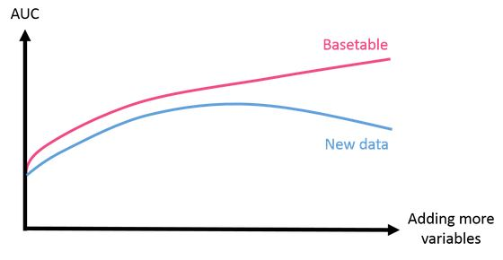
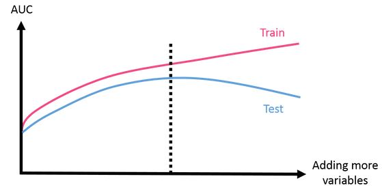
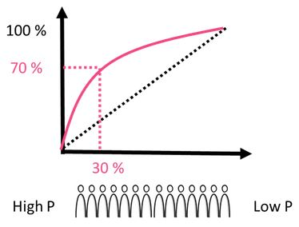
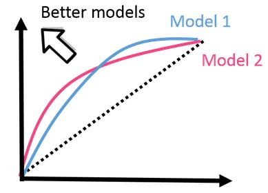
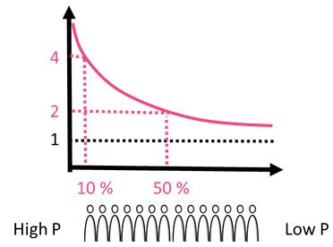
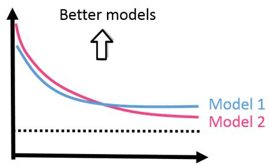
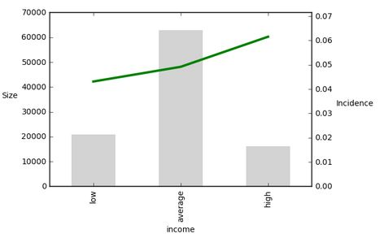
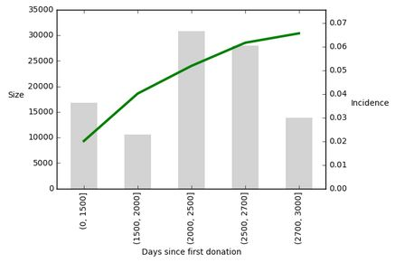

# Predictive-Analytics-in-Python
- Build ML model with meaningful variables. Use model for predictions.
- **Predictive analytics** is an process that aims at predicting an event using historical data. This data is gathered in the analytical basetable.

### Analytical Basetable structure
- An **analytical base table** is typically stored in a pandas dataframe. Three important variables in the analytical basetable are : **`population`**, **`candidate predictors`** and the **`target`**
- **Population** is the group of people or object we want to make the predicton for **(rows of data)**
- **Candidate predictors** is the information that can be used to predict the event **(features)**
- **Target** is the event to **`predict`**, 

```python
import pandas as pd
basetable = pd.DataFrame("import_basetable.csv")
population_size = len(basetable)
targets = sum(basetable["target"])
```

### Logistic Regression

```python
from sklearn import linear_model
logreg = linear_model.LogisticRegression()
X = basetable[['age']]
y = basetable[['target']]
logreg.fit(X, y)
print(logreg.coef_)
print(logreg.intercept_)

```

### Multivariate logistic regression
- Univariate : ax+b
- Multivariate : a1x1 + a2x2 + a3x3 +....+ anxn + b

### Making predictions

```python
new_data = current_data[["gender_F", "ag", "time_since_last_gift"]]
predictions = logreg.predict(new_data)
```

### Variable selection

#### Drawbacks of models with many variables
- Overfitting
- Hard to maintain or implement
- Hard to interpret, multi-collinearity : correalted variables make interpretation harder

- The goal of variable selection is to select a set of variables that has optimal performance

### Model evaluation : AUC
- A metric often used to quantify the model performance is AUC value. It is a value between 0 & 1, "1" being the perfect model.

```python
from sklearn.metrics import roc_auc_score
roc_auc_score(true_target, prob_target)
```

- **`the model with 5 variables has the same AUC as the model using only 2 variables. Adding more variables doesn't always increase the AUC`**

- **`AUC score can be used to determine whether increasing or decreasing the model variables increases the performance or not`**


### Forward stepwise variable selection : Intutive way of variable selection
- The forward stepwise variable selection procedure:
**First** it selects among all the candidate predictors the variable that has the best AUC when used in the model. **Next**, it selects another candidate predictor that has the best AUC incombination with the first selected variable. This continues until all variables are added or until predefined number of variables is added.
- Find best variable **v1**
- Find best variable **v2** in combination with **v1**
- Find best variable **v3** in combination with **v1,v2**
- **Until all variables are added or until predefined number of variables is added**

### Implementation of the forward stepwise variable selection
- Function **auc** that calculates AUC given a certain set of variables
- Function **best_next** that returns next best variable in combination with current variables
- Loop until desired number of variables


### Implementation of AUC function

```python
from sklearn import linear_model
from sklearn.metrics import roc_auc_score

def auc(variables, target, basetable):
    X = basetable[variables]
    y = basetable[target]
    
    logreg = linear_model.LogisticRegression()
    logreg.fit(X,y)
    
    predictions = logreg.predict_proba(X)[:,1]
    auc = roc_auc_score(y, predictions)
    return auc
```

- calling **auc**

```python
auc = auc(["age","gender_F"], ["target"], basetable)
print(round(auc, 2))
```

### Calculating the next best vriable

```python
def next_best(current_variable, candidate_variable, target, basetable):
    """function looks throughout candidate variables and keeps track of which  variable is best and the auc associated with the best variable"""
    best_auc = -1
    best_variable = None
    
    # for each variable in the candidate variable set calculate the AUC
    # current_variable : variables which are already in the model
    # extend it with the variable with which we need to evaluate
    for v in candidate_variables:
        auc_v = auc(current_variables + [v], target, basetable)
        
    # if this AUC is better then the best AUC, change the best AUC and best variable
    if auc_v >= best_auc:
        best_auc = auc_v
        best_variable = v
    return best_variable
```

- If we want to know which variable among `min_gift, max_gift, mean_gift` should be added next given that `age and gender_F` are already in the model, we can use **`next_best`** function as follows;

```python
current_variables = ["age", "gender_F"]
candidate_variables = ["min_gift", "max_gift", "mean_gift"]
next_variable = next_best(current_variables, candidate_variables, basetable)
print(next_varible)
```

- To complete the forward stepwise variable selection procedure, we keep track of the candidate variables and current variables added to the model so far

```python
candidate_variables = ["mean_gift", "min_gift", "max_gift","age","gender_F", "country_USA", "income_low"]
current_variables = []
target = ["target"]
```

- We can define the max number of variables that can be added. In each iteration, the next_best variable is calculated using the next_best function. The current variable list is updated by already chosen variable and the chosen variable is removed from the candidate variable list.

```python
max_number_variables = 5
number_iterations = min(max_number_variables, len(candidate_variables))
for i in range(0, number_iterations):
    next_var = next_best(current_variables, candidate_variables, target, basetable)
    current_variables = current_variables + [next_variable]
    candidate_variables.remove(next_variable)
    
print(current_variables)
```

### Deciding on the number of variables
- Forward Stepwise variable selection returns the order in which the variables increase the accuracy, but we need to decide on how many variables to use.

```python
auc_values = []
variables_evaluate = []

for v in variables_forward:
    variables_evaluate.append(v)
    auc_value = auc(variables_evaluate, ["target"], basetable)
    auc_values.append(auc_value)
```

- Inorder to do so, we can have a look at the **AUC values**. The order of the variables is given in the list `variables_forward`. For each variable in variable forward calculate the AUC values.

<p align="center">
  
</p>

- If we plot the AUC values we obtain a curve that typically keeps increasing
. However, if we use new data to evaluate subsequent models it doesn't increase, instead it decreases after a while. This phenomenon is called overfitting.
- By adding more variables the accuracy on the data on which model is built increases, but the true performance of the model decreases because the complex model doesnt generalize to other data.

#### Detecting over-fitting
- There exits smart techniques to detect and prevent overfitting. Performance on the test dataset is representative of the true performance of the model.
- One way of partioning data is randomly dividing the data into two parts, however when the data is imbalanced it is important to make sure that the target variable is in same proportion in train and test. It can be done by using **`stratify`** on the target while splitting the data.

```python
from sklearn.model_selection import train_test_split

X = basetable.drop("target", 1)
y = basetable["target"]

X_train, X_test, y_train, y_test = train_test_split(X, y, test_size=0.4, stratify = Y)

train = pd.concat([X_train, y_train], axis=1)
test = pd.concat([X_test, y_test], axis=1)
```

#### Deciding the cut-off

<p align="center">
  
</p>

- We can now plot AUC curves of the subsequent models on both the train and test data.We can see that the train AUC keeps increasing while the test AUC stabalizes and then decreases.
- When deciding on how many variables to keep in the model, once we take into account that **test AUC is as high as possible** and the **model should have least variables possible**.
- In this case it's clear that the cut-off indicated by the dashed line is the best option. All models having more variables has lower test accuracy.

## Explaining model performance to business

### The cumulative gains curve
- Once the model is ready we need to show it to the business. VIsualization of model performance that business people can understand.
- Until now we evaluated models using the AUC. Though it is very useful for data scientist it is less appropriate if we want to discuss the model performance with business stakeholders.
- Indeed, AUC is a bit complex evaluation measure that is not much intutive.Moreover, its a single number which doesn't catch all the information about the model.
- For better visualization we can use evaluation curve like the cumulative gains curve. This type of curves are easy to explain and guide us to better business decisions.

#### **Cumulative gains curve** is constructed as follows :

<p align="center">
  
</p>

- First, we order all the observations according to the output of the model. One the LHS are the observations with the highest probabilty to be target according to the model and on the RHS are the observations with lowest probabilty to be target.
- On the horizontal axis of cumulative gains curve, it is indicated which percentage of the observations is considered. For instance, 30% of the observations with the highest probabilty to be target is considered.
- On the vertical axis, the curve indicates which percentage of all targets is included in this group. For instance, if the cumulative gain is 70% at 30%, it means we are taking the top 30% observations with highest probabilty to be target, this group contains already 70% of all targets. 

<p align="center">
  
</p>

- The cumulative gains curve is the great tool to compare models. **The more the line is situated to the upper left corner, the better the model**. It is often the case that two models produce curves that cross each other. In that case, it is not straightforward to decide which model is best. In this case, for instance, we can say that model 2 is better to distinguish the top 10% observations from the rest, while model 1 is better to distinguish the top 70% of the observations from the rest.

#### Cumulative gains in python
- Constructing cumulative gains curves in Python is easy with the **scikitplot** module.

```python
import scikitplot as skplt
import matplotlib.pyplot as plt

skplt.metrics.plot_cumulative_gain(true_values, predictions)
plt.show()
```
- **Note that predictions should have values for both targets 1 and 0.** We can use `predict_proba` to get prediction probablities for both the targets.README

### The Lift Curve
- In addition to the cumulative gains curve, the lift curve is a widely used visualisation of model performance.

<p align="center">
  
</p>

- Constructing a lift curve follows a similar process as constructing a cumulative gains curve. First, we order all the observations according to the model. On the horizontal axis of the lift curve, we indicate which percentage of the observation is considered. On the vertical axis, the lift curve indicates how many times more than average targets are included in this group.
- Consider for instance the lift at 10%, and assume that the top 10% observations contains 20% targets. If the average percentage of targets is 5%, the lift is 4, because 20% is 4 times 5%.
- As another example, consider the lift at 50%, and assume that the top 50% observations contain 10% targets. As 10% is 2 times 5%, the average percentage of targets, the lift is 2 at 50%.

#### Lift curve interpretation

<p align="center">
  
</p>

- A random model has a more or less equal percentage of targets for each group, and therefore the baseline is 1. Better models has higher lifts. Therefore **curves that are higher, have better accuracy**. However, as for cumulative gains curve, also lift curves of different models can cross each other.
- Consider the example given here: model 2 is higher at 10%, but model 1 is higher at 80%. In that case it is hard to say which model is best, as it depends on the situation.If we can target 10% of the population, model 2 is better suited because we can reach more targets, whereas model 1 is better if we want to target a larger part of the population.

#### Lift curve in Python

```python
import scikitplot as skplt
import matplotlib.pyplot as plt

skplt.metrics.plot_lift_curve(true_values, predictions)
plt.show()
```

### Guiding business to better decisions
- One way to make use of lift graph is to estimate the profit for a campaign

#### Estimating profit
- The population consists of 100000 candidate donors, and 5% among these candidate donors is target. Assume that we expect targets to donate 50 Euro, and that addressing a donor, for instance by sending him a letter, costs 2 Euro. Given this info we can calculate the expected profit of a campaign.
- The profit depends on 5 elements: the percentage of targets in the selected donor group, the percentage selected donors, the population size and the reward of reaching a target and the cost of the campaign.
- The total cost of the campaign is the cost of the campaign, 2 Euro, times the no of donors addressed, which is the percentage of selected donors times the population size.
- The reward of the campaign is the reward of reaching a target times the number of targets reached. The final profit is then the reward minus the cost.
- Assume that we address the top 20% donors with the highest probabilty to donate according to the model.


```python
population = 100000
target_incidence = 0.05
reward_target = 50
cost_campaign = 2

def profit(perc_targets, perc_selected, population_size, reward_target, cost_campaign)
    cost = cost_campaign * perc_selected * population_size
    reward = reward_target * perc_targets * perc_selected * population_size
    return (reward - cost)

perc_selected = 0.20
lift = 2.5
perc_targets = lift * target_incidence
print(profit(perc_targets, perc_selected, population_size, reward_target, cost_campaign))
```


## Interpreting and explaining models

### Predictor Insights Graphs
- It is important to check with business and domain experts whether the model is interpretable. In a typical predictive modelling project, we proceed as follows when we need to make a prediction model:
- **1)** First, we contruct a predictive model (Build model)
- **2)** Then, we can evaluate the predictive model using the AUC accuracy metric, and additionally using the cumulative gains and lift curves. 
- **3)** One last step that we should carry out to make sure that the model is sound and logical, is to interpret the variables in our model, and verify whether the link between these variables and the target makes sense. (Verify whether the variables in the model are interpretable)

- Here we can use the **predictor insights graphs**

#### Predictor insights graphs for categorical variable

<p align="center">
  
</p>

- **These graphs shows the link between the predictive variables and the target that we want to predict**.
- Consider for instance this predictor insight graph that shows the relationship between income and donations. On the horizontal axis, the predictive variable is divided into 3 groups, donors with low, average and high income. The height of the grey bars indicate how many donors are in each group and is associated with the left hand side vertical axis. The green line indicates the perentage of targets in each group and is associated with the RHS vertical axis.
- In this graph, we can see that the higher someones income is the more likely he is to donate for the campaign. **This interpretation is logical, so it makes sense to keep variables related to income in the model.**

#### Predictor insights graphs for continous variable

<p align="center">
  
</p>

- If the variable is continuos, an additional **discretization step that divides the continuos variables in bins** is needed. Above example shows the relationship between the time since someone first donated and the target.
- The continuous variable `days since first donation` is split in five groups of equal size, and then the size of each group and target incidence is plot for each group. **It shows that the longer someone is a donor, the more likely he is to donate for the campaign.**

#### The predictor insight graph table

|Income   |size    | Incidence|
:--------:|:------:|:--------:|
|low      |20850   |0.0431    |
|average  |62950   |0.0492    |
|high     |16200   |0.0615    |

- The values that are plotted in the predictor insight graph, is collected in a predictor insight graph table. This table has 3 columns: the categories that are displayed on the horizontal axis, the size of the group as displayed on LHS axis and the target incidence of each group displayed on the RHS axis.
- We can access elements in the predictor insight graph using indexing

```python
print(pig_table["size"][income=="low"])
```

### Constructing a predictor insights graph
- **1)** If the variable at hand is continous, first discretize the variable
- **2)** Next, calculate the values that are needed to make the plot, these values are gathered in the PIG table (Calculate predictor insight graph table)
- **3)** Finally, plot the predictor insight graph

### Preparing the predictor insights graph table

```python
import numpy as np

# function that calculates the predictor insight graph table
def create_pig_table(df, target, variable):
	
	# group by the variable we want to plot
	groups = df[[target, variable]].groupby(variable)

	#calculate the size and incidence of each group
	pig_table = groups[target].agg({'Incidence':np.mean, 'size': np.size}).reset_index()
	return pig_table
print(create_pig_table(basetable, "target", "country")
```

- Construct the table that is needed to plot the predictor insight graphs.A PIG table is a table that has all the information necessary to create the predictor insight graph.It has one row for each group in the variable that we want to plot, and three columns.The first column contains the names of the groups, incase the original variable is continuous, these are the names of intervals it was discretized in. The second column shows the average target incidence of the group:what is the mean target in this group.The 3rd column shows the size of each group i.e the number of observations that belongs to the particular group.
- We can easily construct a predictor insight graph for a given basetable, target and variable.In `create_pig_table` function we first group the basetable by the variable we want to make the predictor insight graph for. In these groups, we only need the variable and target values, that is why we only select these in this step.Next we use the aggregate function on these groups to create two columns.The first column is the target incidence, which is the mean of the target,2nd column is the size i.e the no of observations in each group. With this function we can easily calculate the predictor insight graph table for any variable.

#### Calculating multiple predictor insight graph tables
- Instead of calculating them one by one, we could do this automatically and store the PIG tables in a dictionary.

```python
# variable to plot
variables = ['country', 'gender', 'disc_mean_gift', 'age']

# empty dictionary
pig_tables = {}

#loop over all variables
for variable in variables:
	
	# create the PIG table
	pig_table = create_pig_table(basetable, "target", variable)

	# store the table in the dict
	pig_table[variable] = pig_table
```

- We can print PIG for any variable using the `pig_tables` dictionary.

### Plotting the predictor insight graph
- The PIG shows the link between a predictor and the target. For instance, the predictor insight graph of the predictor gender shows that females are more likely to donate.Additionally, this graph also shows the size of the different groups.
- We construct the graph in two steps: First, we plot the target incidence line, and secondly we will plot the bars that show the group sizes as well. The values needed to contruct the PIG can be obtained from the PIG table.
- Inorder to add the graphs with the sizes we need to add few lines of code

```python
import matplotlib.pyplot as plt
import numpy as np

# plot the graph
plt.ylabel("size", rotation=0, rotation_mode="anchor", ha="right")

pig_table["Incidence"].plot(secondary_y = True)

pig_table["Size"].plot(kind='bar', width=0.5, color="lightgray", edgecolor="none")

#show the group names
plt.xticks(np.arange(len(pig_table)), pig_table['income'])

#center the group names by adding margin to LHS and RHS of the plot
width=0.5
plt.xlim([-width, len(pig_table) - width])

#add label incidence to the vertical axis
plt.ylabel("incidence", rotation = 0, rotation_mode="anchor", ha="right")

# add label income to the horizontal axis
plt.xlabel("Income")
plt.show()
```

### Selecting relevant data (Timeline of data)

```python
import pandas as pd

data['date'] = pd.to_datetime(data['date'])

start_target = datetime(year = 2018, month = 5, day = 1)
end_target = datetime(year = 2018, month = 8, day = 1)

gifts_target = gifts[(gifts['date'] >= start_target) & (gifts['date'] < end_target)]
```

gifts_pred_variables = gifts[(gifts['date'] < start_target)]
```


        
    


